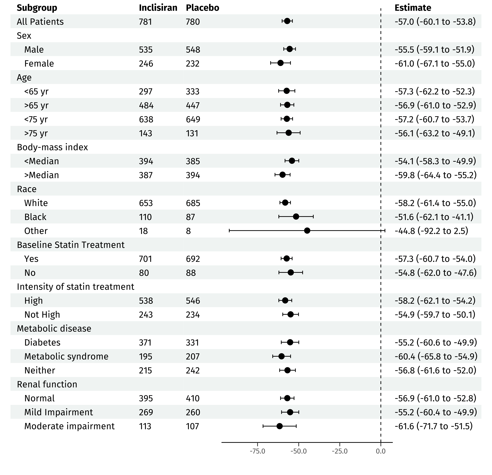

<!-- README.md is generated from README.Rmd. Please edit that file -->

# forestable

<!-- badges: start -->

<!-- badges: end -->

The goal of forestable is to make it easy for you to create a
publication-quality forest plot with as much or as little information
displayed on either side as you require.

## Installation

This package is currently early in development, and must be installed
from this github repo.

``` r
devtools::install_github("rdboyes/forestable")
```

## Example

Suppose we wish to replicate the following figure published in the NEJM
\[1\]:


Forestable simply requires the left side of the table (in this case,
three columns with Subgroups and counts for each of two groups) and
vectors which contain the point estimates and confidence intervals.

``` r
library(forestable)

table <- readxl::read_excel(here::here("inst/extdata/example_figure_data.xlsx"))

# indent the subgroup if there is a number in the placebo column
table$Subgroup <- ifelse(is.na(table$Placebo), 
                         table$Subgroup,
                         paste0("   ", table$Subgroup))

# remove indent of the first row
table$Subgroup[1] <- "All Patients"

# use forestable to create the table with forest plot
forestable(left_side_data = table[,1:3],
           estimate = table$Estimate,
           ci_low = table$`CI low`,
           ci_high = table$`CI high`,
           display = FALSE,
           file_path = here::here("man/figures/forestable_plot.png"))
#> Warning: Removed 8 rows containing missing values (geom_point).
#> Warning: Removed 8 rows containing missing values (geom_errorbarh).
```


Forestable handles the alignment of the graph and the table
automatically, so figures with fewer rows or columns should work by
simply passing a smaller data frame to the function:

``` r
forestable(left_side_data = table[1:12,1:3],
           estimate = table$Estimate[1:12],
           ci_low = table$`CI low`[1:12],
           ci_high = table$`CI high`[1:12],
           display = FALSE,
           file_path = here::here("man/figures/fewer_rows.png"))
#> Warning: Removed 3 rows containing missing values (geom_point).
#> Warning: Removed 3 rows containing missing values (geom_errorbarh).
```


``` r
forestable(left_side_data = table[,1],
           estimate = table$Estimate,
           ci_low = table$`CI low`,
           ci_high = table$`CI high`,
           display = FALSE,
           file_path = here::here("man/figures/fewer_cols.png"))
#> Warning: Removed 8 rows containing missing values (geom_point).
#> Warning: Removed 8 rows containing missing values (geom_errorbarh).
```


## Additional Fonts

While Courier has a certain appeal, you might want to give your tables a
more modern look. However, due to the difficulty of aligning all
elements when using them, the use of non-monospaced fonts should be
considered experimental at this stage.

``` r
library(extrafont)
#> Registering fonts with R

loadfonts(device = "win")
windowsFonts("Fira Sans" = windowsFont("Fira Sans"))

forestable(left_side_data = table[,1:3],
           estimate = table$Estimate,
           ci_low = table$`CI low`,
           ci_high = table$`CI high`,
           display = FALSE,
           file_path = here::here("man/figures/forestable_plot_fira.png"),
           font_family = "Fira Sans")
#> Warning: Removed 8 rows containing missing values (geom_point).
#> Warning: Removed 8 rows containing missing values (geom_errorbarh).
```



## To Do

  - Better additional font support
  - Additional plot types, including ridgeline plots
  - Add tests of any kind

## References

1.  Ray, K. K., Wright, R. S., Kallend, D., Koenig, W., Leiter, L. A.,
    Raal, F. J., Bisch, J. A., Richardson, T., Jaros, M., Wijngaard, P.
    L. J., Kastelein, J. J. P., & ORION-10 and ORION-11 Investigators.
    (2020). Two Phase 3 Trials of Inclisiran in Patients with Elevated
    LDL Cholesterol. The New England Journal of Medicine, 382(16),
    1507–1519.
