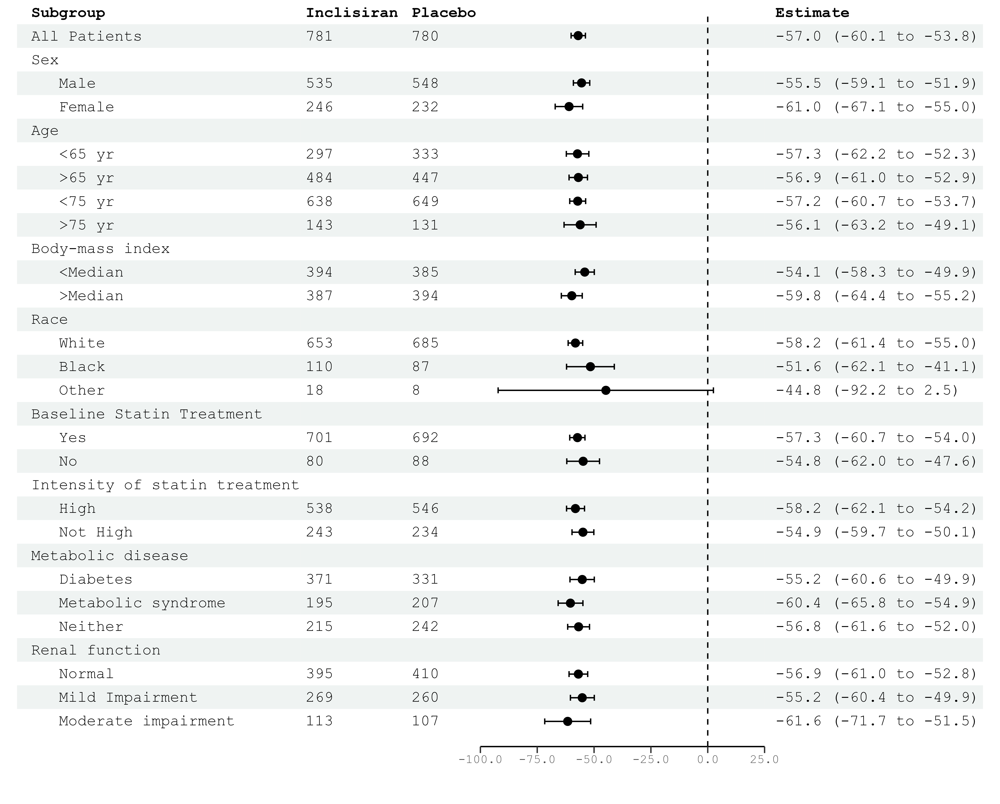
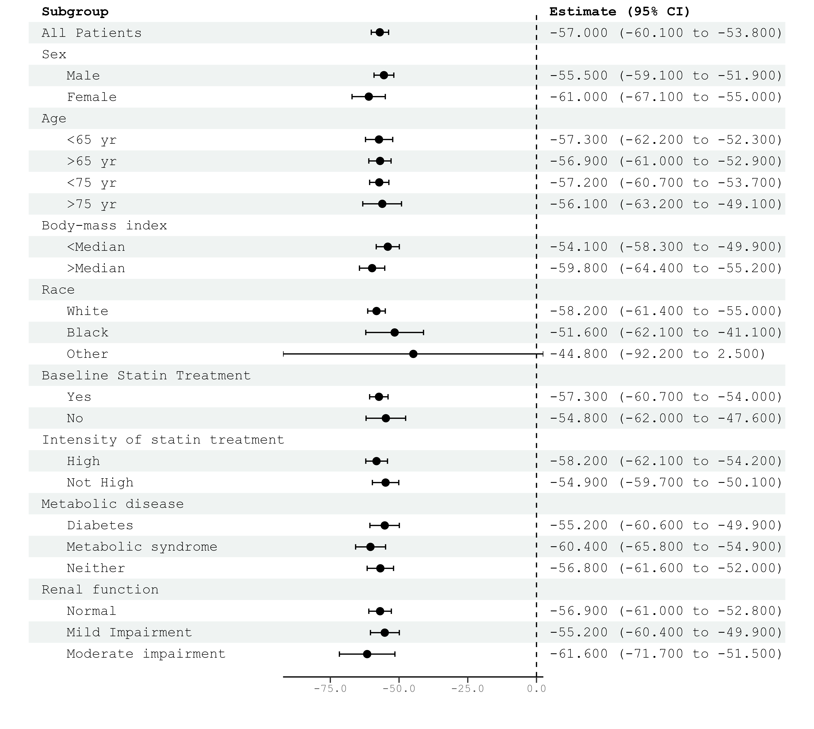
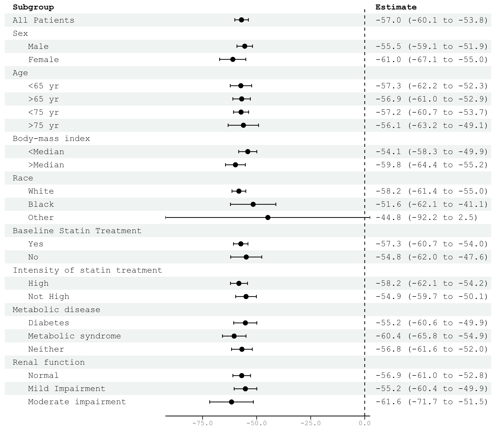
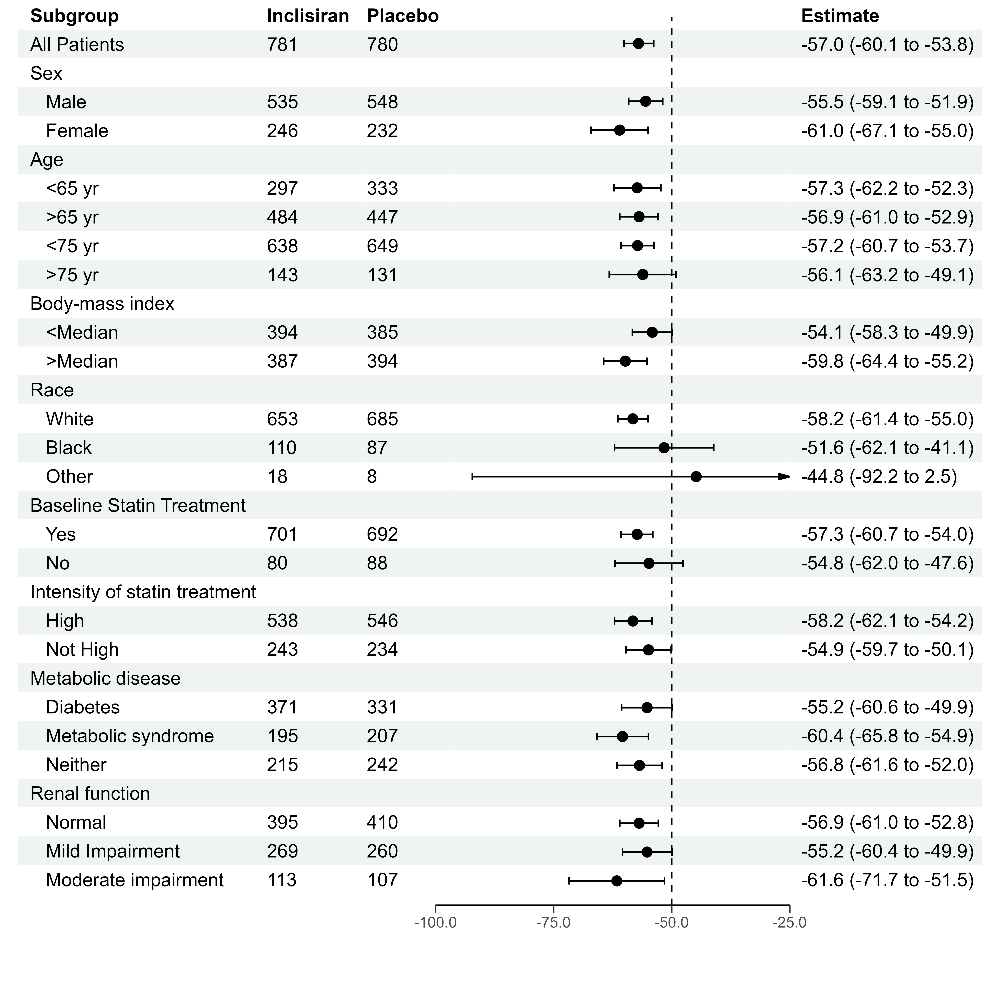
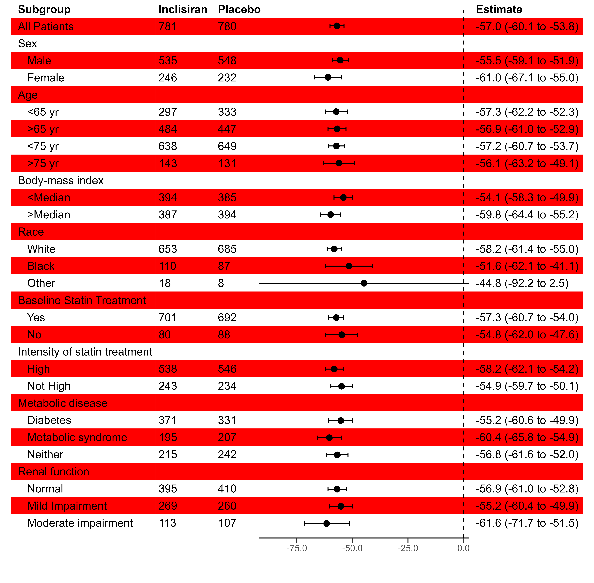

<!-- README.md is generated from README.Rmd. Please edit that file -->

# Forester

<!-- badges: start -->
<!-- badges: end -->

The goal of forester is to make it easy for you to create a
publication-quality forest plot with as much or as little information
displayed on either side as you require.

## Installation

This package is currently early in development, and must be installed
from this github repo.

``` r
devtools::install_github("rdboyes/forester")
```

## Basic Usage

Suppose we wish to replicate the following figure published in the NEJM
\[1\]:


forester simply requires the left side of the table (in this case, three
columns with Subgroups and counts for each of two groups) and vectors
which contain the point estimates and confidence intervals.

``` r
library(forester)

table <- readxl::read_excel(here::here("inst/extdata/example_figure_data.xlsx"))

# indent the subgroup if there is a number in the placebo column
table$Subgroup <- ifelse(is.na(table$Placebo), 
                         table$Subgroup,
                         paste0("   ", table$Subgroup))

# remove indent of the first row
table$Subgroup[1] <- "All Patients"

# use forester to create the table with forest plot
forester(left_side_data = table[,1:3],
           estimate = table$Estimate,
           ci_low = table$`CI low`,
           ci_high = table$`CI high`,
           display = FALSE,
           xlim = c(-100, 25),
           file_path = here::here("man/figures/forester_plot.png"))
```



Forester handles the alignment of the graph and the table automatically,
so figures with fewer rows or columns should work by simply passing a
smaller data frame to the function:

``` r
forester(left_side_data = table[1:12,1:3],
           estimate = table$Estimate[1:12],
           ci_low = table$`CI low`[1:12],
           ci_high = table$`CI high`[1:12],
           display = FALSE,
           file_path = here::here("man/figures/fewer_rows.png"))
```


``` r
forester(left_side_data = table[,1],
           estimate = table$Estimate,
           ci_low = table$`CI low`,
           ci_high = table$`CI high`,
           display = FALSE,
           file_path = here::here("man/figures/fewer_cols.png"))
```


## Display Options

By default, forester will both display the plot in the RStudio viewer
(`display = TRUE`) and save a high quality version to the current
directory (`file_path = here::here("forester_plot.png")`) at a
resolution controllable by `dpi`. When making a rmarkdown document (such
as this one), these options should be overwritten as required. You can
display the images created by forester using standard RMarkdown syntax
(i.e. ``).

## Font Families

Pass any font to `font_family` to control the output font. Tested
options include `"mono"`, `"sans"`, and `"serif"`. Any font will work,
but alignment may not be perfect for untested fonts. Use the provided
options `nudge_x` and `nudge_y` to correct alignment issues.

``` r
library(extrafont)
#> Registering fonts with R

loadfonts(device = "win")
windowsFonts("Fira Sans" = windowsFont("Fira Sans"))

forester(left_side_data = table[,1:3],
           estimate = table$Estimate,
           ci_low = table$`CI low`,
           ci_high = table$`CI high`,
           display = FALSE,
           file_path = here::here("man/figures/forester_plot_fira.png"),
           font_family = "Fira Sans")
```


## Right Side Data

The option `estimate_precision` can be used to change the number of
decimals displayed in the right hand side table. `estimate_col_name`
allows you to change the name of the default right side column. If you
require more control, pass a dataframe to `right_side_data` to override
the right side completely.

``` r
forester(left_side_data = table[,1],
           estimate = table$Estimate,
           ci_low = table$`CI low`,
           ci_high = table$`CI high`,
           display = FALSE,
           estimate_precision = 3,
           estimate_col_name = "Estimate (95% CI)",
           file_path = here::here("man/figures/more_precise.png"))
```



## Plot Width

Change `ggplot_width` from its default value of 30 to adjust the
relative amount of space that the figure takes up. `nudge_x` can be used
to correct alignment issues if this option causes any.

``` r
forester(left_side_data = table[,1],
           estimate = table$Estimate,
           ci_low = table$`CI low`,
           ci_high = table$`CI high`,
           display = FALSE,
           ggplot_width = 40,
           nudge_x = .5,
           file_path = here::here("man/figures/more_plot_width.png"))
```



## Limits, Breaks, and the Null Line

Limits and breaks are set automatically, but the defaults can be
overwritten using `xlim` (use a vector of length 2, i.e. c(low, high))
and `xbreaks` (use a vector indicating the breaks). `null_line_at`
defaults to 0, but can be set to any value. This would be most commonly
used to set the `null_line_at = 1.0` for relative measures.
`x_scale_linear` defaults to `TRUE` but can be set to `FALSE` if a
logarithmic scale is required. If a confidence interval extends outside
the range set by `xlim`, it will automatically be indicated using an
arrow.

``` r
forester(left_side_data = table[,1:3],
           estimate = table$Estimate,
           ci_low = table$`CI low`,
           ci_high = table$`CI high`,
           display = FALSE,
           file_path = here::here("man/figures/limit_breaks.png"),
           font_family = "Fira Sans",
           null_line_at = -50,
           xlim = c(-100, -25),
           xbreaks = c(-100, -75, -50, -25))
```



## Table Colour Options

As pointed out
[here](https://twitter.com/davidrfeinberg/status/1375417579095924738),
the default colour scheme looks a bit retro. Personally, I like the
default stripe colour “\#eff3f2”, but you can change the stripe colour
to anything you want :)

``` r
forester(left_side_data = table[,1:3],
           estimate = table$Estimate,
           ci_low = table$`CI low`,
           ci_high = table$`CI high`,
           display = FALSE,
           file_path = here::here("man/figures/stripe_colour.png"),
           font_family = "Fira Sans",
           stripe_colour = "#ff0000"
           )
```



## Adding Arrows

Arrows can be added below the plot area (with `arrows = TRUE`) and
labelled (with `arrow_labels = c("Left Label", "Right Label")`).

``` r
forester(left_side_data = table[,1:3],
           estimate = table$Estimate,
           ci_low = table$`CI low`,
           ci_high = table$`CI high`,
           display = FALSE,
           file_path = here::here("man/figures/forester_plot_arrows.png"),
           font_family = "Fira Sans",
           null_line_at = 0,
           xlim = c(-100, 25),
           xbreaks = c(-100, -75, -50, -25, 0, 25),
           arrows = TRUE, 
           arrow_labels = c("Inclisiran Better", "Placebo Better"))
```


## Point Size and Shape

The size and shape of the points can be controlled using vectors of
values passed to `point_sizes` and `point_shapes`.

``` r
shapes <- rep(16, times = 30)

shapes[1] <- 17

sizes <- rep(3.25, times = 30)

sizes[30] <- 5

forester(left_side_data = table[,1:3],
           estimate = table$Estimate,
           ci_low = table$`CI low`,
           ci_high = table$`CI high`,
           display = FALSE,
           file_path = here::here("man/figures/size_shape.png"),
           font_family = "Fira Sans",
           null_line_at = 0,
           xlim = c(-100, 25),
           xbreaks = c(-100, -75, -50, -25, 0, 25),
           arrows = TRUE, 
           arrow_labels = c("Inclisiran Better", "Placebo Better"),
           point_sizes = sizes,
           point_shapes = shapes)
```


## Adding Additional ggplot Objects

Custom ggplot objects can be passed to the `forester` function using the
parameter `add_plot`. To align the plot with the rows of the table, the
vertical center of the bottom row is at y = 0, and each row is one unit
tall on the y axis. `add_plot_width` can be set to customize the width
of the plot (units are relative to the width of the table).

``` r
library(ggplot2)
library(tibble)
#> Warning: package 'tibble' was built under R version 4.0.4

ex_plot <- ggplot(tibble(x = rep(1:7, each = 15), y = rep(0:14, times = 7)), aes(x = x, y = y)) +
  geom_point()

forester(left_side_data = table[1:15,1:3],
           estimate = table$Estimate[1:15],
           ci_low = table$`CI low`[1:15],
           ci_high = table$`CI high`[1:15],
           display = FALSE,
           add_plot = ex_plot,
           file_path = here::here("man/figures/add_dots.png"))
```


## References

1.  Ray, K. K., Wright, R. S., Kallend, D., Koenig, W., Leiter, L. A.,
    Raal, F. J., Bisch, J. A., Richardson, T., Jaros, M., Wijngaard, P.
    L. J., Kastelein, J. J. P., & ORION-10 and ORION-11 Investigators.
    (2020). Two Phase 3 Trials of Inclisiran in Patients with Elevated
    LDL Cholesterol. The New England Journal of Medicine, 382(16),
    1507–1519.
