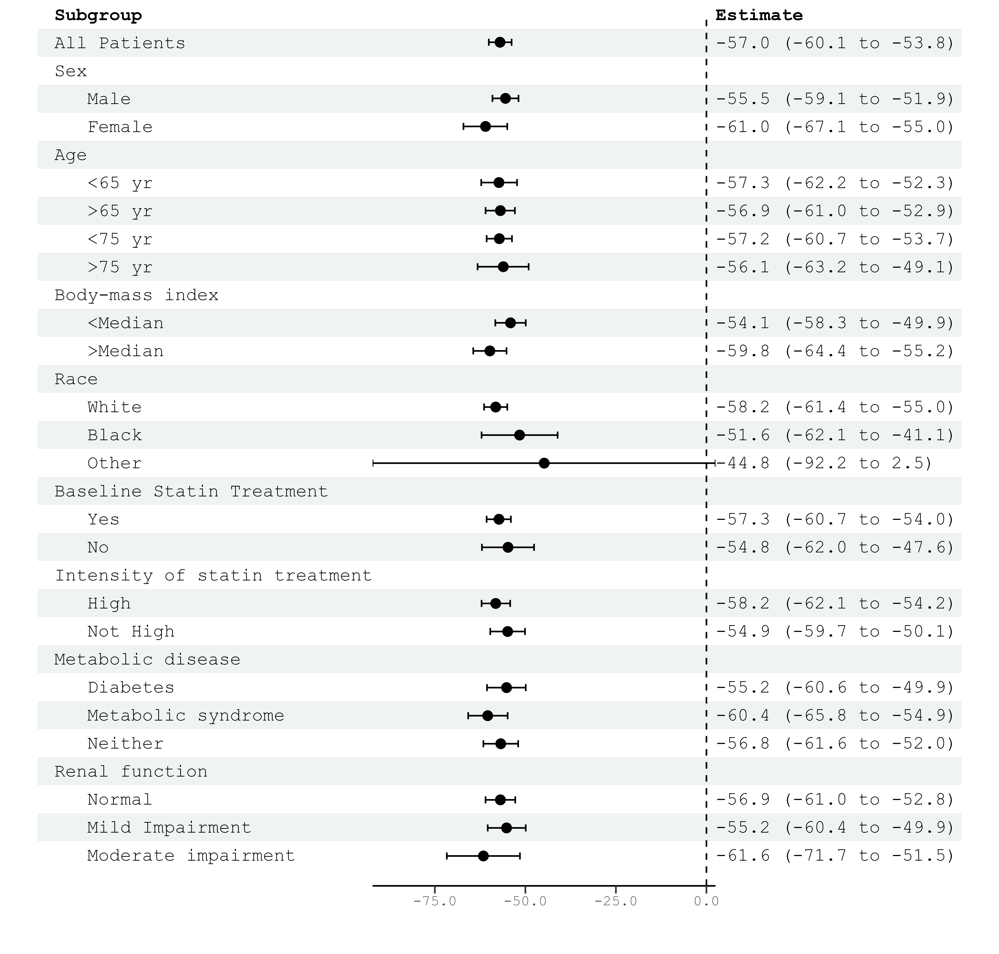
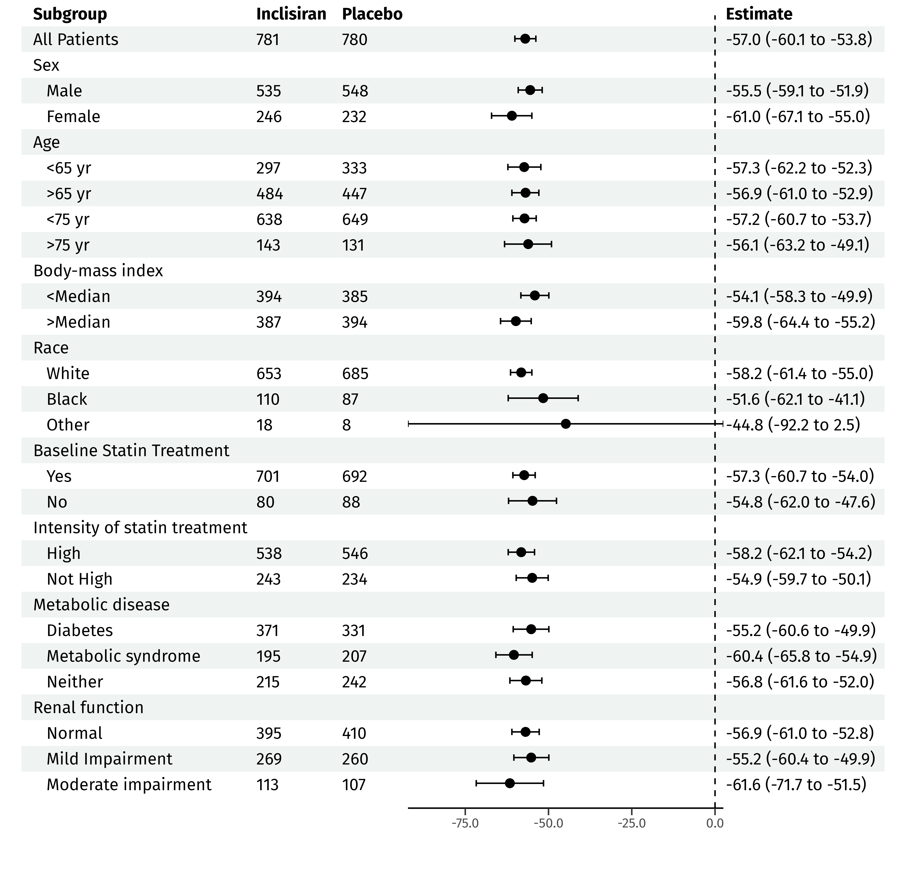
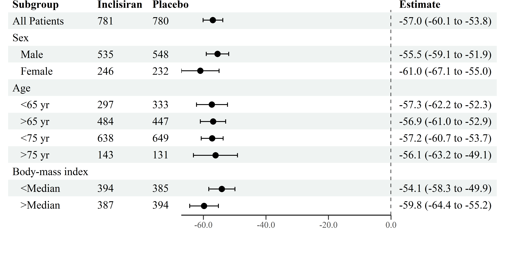
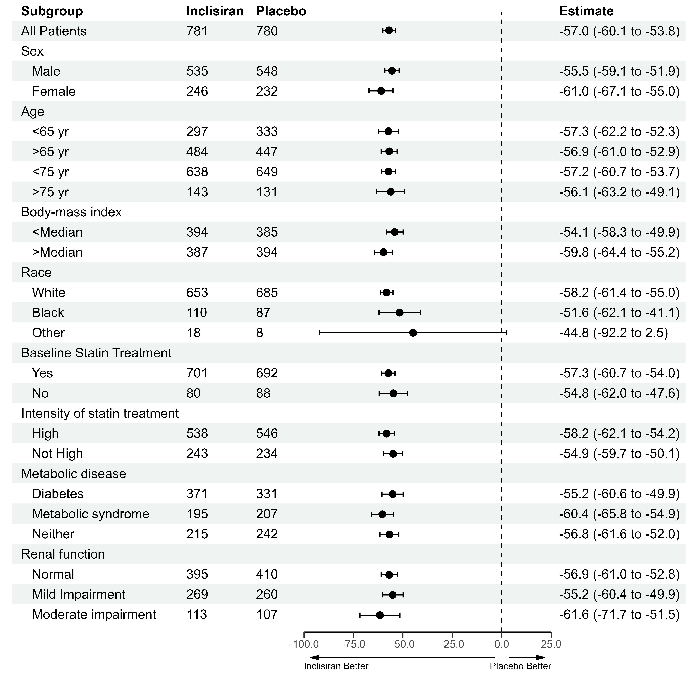

<!-- README.md is generated from README.Rmd. Please edit that file -->

# forester

<!-- badges: start -->
<!-- badges: end -->

The goal of forester is to make it easy for you to create a
publication-quality forest plot with as much or as little information
displayed on either side as you require.

## Installation

This package is currently early in development, and must be installed
from this github repo.

``` r
devtools::install_github("rdboyes/forester")
```

## Example

Suppose we wish to replicate the following figure published in the NEJM
\[1\]:


forester simply requires the left side of the table (in this case, three
columns with Subgroups and counts for each of two groups) and vectors
which contain the point estimates and confidence intervals.

``` r
library(forester)

table <- readxl::read_excel(here::here("inst/extdata/example_figure_data.xlsx"))

# indent the subgroup if there is a number in the placebo column
table$Subgroup <- ifelse(is.na(table$Placebo), 
                         table$Subgroup,
                         paste0("   ", table$Subgroup))

# remove indent of the first row
table$Subgroup[1] <- "All Patients"

# use forester to create the table with forest plot
forester(left_side_data = table[,1:3],
           estimate = table$Estimate,
           ci_low = table$`CI low`,
           ci_high = table$`CI high`,
           display = FALSE,
           xlim = c(-100, 25),
           file_path = here::here("man/figures/forester_plot.png"))
#> Scale for 'x' is already present. Adding another scale for 'x', which will
#> replace the existing scale.
#> Scale for 'x' is already present. Adding another scale for 'x', which will
#> replace the existing scale.
#> Warning: Removed 8 rows containing missing values (geom_point).
#> Warning: Removed 8 rows containing missing values (geom_errorbarh).
```


forester handles the alignment of the graph and the table automatically,
so figures with fewer rows or columns should work by simply passing a
smaller data frame to the function:

``` r
forester(left_side_data = table[1:12,1:3],
           estimate = table$Estimate[1:12],
           ci_low = table$`CI low`[1:12],
           ci_high = table$`CI high`[1:12],
           display = FALSE,
           file_path = here::here("man/figures/fewer_rows.png"))
#> Scale for 'x' is already present. Adding another scale for 'x', which will
#> replace the existing scale.
#> Warning: Removed 3 rows containing missing values (geom_point).
#> Warning: Removed 3 rows containing missing values (geom_errorbarh).
```


``` r
forester(left_side_data = table[,1],
           estimate = table$Estimate,
           ci_low = table$`CI low`,
           ci_high = table$`CI high`,
           display = FALSE,
           file_path = here::here("man/figures/fewer_cols.png"))
#> Scale for 'x' is already present. Adding another scale for 'x', which will
#> replace the existing scale.
#> Warning: Removed 8 rows containing missing values (geom_point).
#> Warning: Removed 8 rows containing missing values (geom_errorbarh).
```



## Additional Fonts

While Courier has a certain appeal, you might want to give your tables a
more modern look. However, due to the difficulty of aligning all
elements when using them, the use of non-monospaced fonts should be
considered experimental at this stage.

``` r
library(extrafont)
#> Registering fonts with R

loadfonts(device = "win")
windowsFonts("Fira Sans" = windowsFont("Fira Sans"))

forester(left_side_data = table[,1:3],
           estimate = table$Estimate,
           ci_low = table$`CI low`,
           ci_high = table$`CI high`,
           display = FALSE,
           file_path = here::here("man/figures/forester_plot_fira.png"),
           font_family = "Fira Sans")
#> Scale for 'x' is already present. Adding another scale for 'x', which will
#> replace the existing scale.
#> Warning: Removed 8 rows containing missing values (geom_point).
#> Warning: Removed 8 rows containing missing values (geom_errorbarh).
```

 Adjusting table properties with
different fonts will still work:

``` r
forester(left_side_data = table[1:12,1:3],
           estimate = table$Estimate[1:12],
           ci_low = table$`CI low`[1:12],
           ci_high = table$`CI high`[1:12],
           display = FALSE,
           font_family = "Fira Sans",
           file_path = here::here("man/figures/fewer_rows_fira.png"))
#> Scale for 'x' is already present. Adding another scale for 'x', which will
#> replace the existing scale.
#> Warning: Removed 3 rows containing missing values (geom_point).
#> Warning: Removed 3 rows containing missing values (geom_errorbarh).
```


``` r
windowsFonts("Times New Roman" = windowsFont("Times New Roman"))

forester(left_side_data = table[1:12,1:3],
           estimate = table$Estimate[1:12],
           ci_low = table$`CI low`[1:12],
           ci_high = table$`CI high`[1:12],
           display = FALSE,
           font_family = "Times New Roman",
           file_path = here::here("man/figures/fewer_rows_times.png"))
#> Scale for 'x' is already present. Adding another scale for 'x', which will
#> replace the existing scale.
#> Warning: Removed 3 rows containing missing values (geom_point).
#> Warning: Removed 3 rows containing missing values (geom_errorbarh).
```



## Adding Arrows (Experimental)

``` r
forester(left_side_data = table[,1:3],
           estimate = table$Estimate,
           ci_low = table$`CI low`,
           ci_high = table$`CI high`,
           display = FALSE,
           file_path = here::here("man/figures/forester_plot_arrows.png"),
           font_family = "Fira Sans",
           xlim = c(-100, 25),
           xbreaks = c(-100, -75, -50, -25, 0, 25),
           arrows = TRUE, 
           arrow_labels = c("Inclisiran Better", "Placebo Better"))
#> Scale for 'x' is already present. Adding another scale for 'x', which will
#> replace the existing scale.
#> Scale for 'x' is already present. Adding another scale for 'x', which will
#> replace the existing scale.
#> Warning: Removed 8 rows containing missing values (geom_point).
#> Warning: Removed 8 rows containing missing values (geom_errorbarh).
```



## Adding additional ggplot objects (Experimental)

Custom ggplot objects can be passed to the `forester` function using the
parameter `add_plot`. To align the plot with the rows of the table, the
vertical center of the bottom row is at y = 0, and each row is one unit
tall on the y axis. `add_plot_width` can be set to customize the width
of the plot (units are relative to the width of the table).

## To Do

-   Better additional font support
-   Additional plot types, including ridgeline plots
-   Add tests of any kind

## References

1.  Ray, K. K., Wright, R. S., Kallend, D., Koenig, W., Leiter, L. A.,
    Raal, F. J., Bisch, J. A., Richardson, T., Jaros, M., Wijngaard, P.
    L. J., Kastelein, J. J. P., & ORION-10 and ORION-11 Investigators.
    (2020). Two Phase 3 Trials of Inclisiran in Patients with Elevated
    LDL Cholesterol. The New England Journal of Medicine, 382(16),
    1507–1519.

2.  Lisboa Bastos, M., Tavaziva, G., Abidi, S. K., Campbell, J. R.,
    Haraoui, L.-P., Johnston, J. C., Lan, Z., Law, S., MacLean, E.,
    Trajman, A., Menzies, D., Benedetti, A., & Ahmad Khan, F. (2020).
    Diagnostic accuracy of serological tests for covid-19: systematic
    review and meta-analysis. BMJ , 370, m2516.
